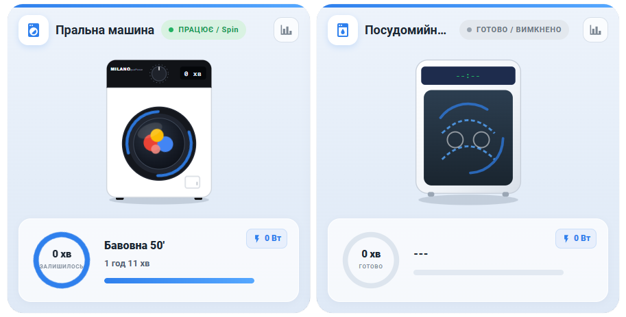
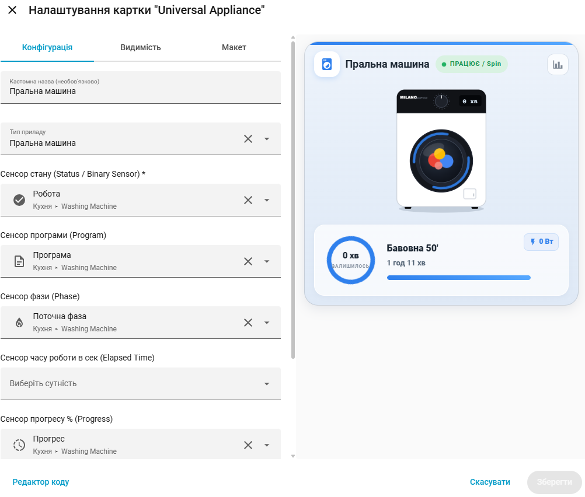

# Appliance Card for Home Assistant

[](https://github.com/hacs/default)
[](https://github.com/WildeRNS/appliance-card/releases)

Анімована картка для Home Assistant для відображення стану **пральної** та **посудомийної** машин із підтримкою **візуального редактора UI**.
Дана картка використовує сенсори з інтеграції [WashData](https://github.com/3dg1luk43/ha_washdata)




## 🚀 Особливості

* 🎨 **Візуальний редактор UI**: Зручне налаштування картки без необхідності редагування YAML.
* 🌀 **Динамічна SVG-анімація**:
  * Анімація барабана та білизни для пральної машини під час роботи.
  * Анімація розпилювачів та води для посудомийної машини.
* ⏱️ **Кільцевий прогрес та таймер**: Індикатор залишкового часу та відсотка виконання програми.
* ⚡ **Індикатор потужності**: Відображення поточного енергоспоживання у Вт / кВт.
* 🌐 **Мультимовність**: Автоматична підтримка української та англійської мов.

---

## 📦 Встановлення

### HACS (Рекомендовано)

1. Відкрийте **HACS** ➔ **Frontend**.
2. Натисніть три крапки у правому верхньому кутку ➔ **Custom repositories**.
3. Додайте посилання: `(https://github.com/WildeRNS/appliance-card)`.
4. Оберіть тип **Dashboard**.
5. Натисніть **Завантажити** (Download) та оновіть сторінку.

---

## ⚙️ Налаштування (YAML)

```yaml
type: custom:appliance-card
appliance_type: washing_machine # або dishwasher
name: Пральна машина
status_entity: sensor.washing_machine_state
program_entity: sensor.washing_machine_program
phase_entity: sensor.washing_machine_phase
progress_entity: sensor.washing_machine_progress
remaining_entity: sensor.washing_machine_remaining_time
power_entity: sensor.washing_machine_power
```

### Параметри конфігурації

| Параметр | Тип | Обов'язковий | Опис |
| :--- | :--- | :---: | :--- |
| `type` | `string` | **Так** | Завжди `custom:appliance-card` |
| `appliance_type` | `string` | Ні | `washing_machine` або `dishwasher` |
| `name` | `string` | Ні | Кастомна назва картки |
| `status_entity` | `string` | **Так** | Сенсор стану (on/off/running) |
| `program_entity` | `string` | Ні | Сенсор назви програми |
| `phase_entity` | `string` | Ні | Сенсор поточного етапу/фази |
| `progress_entity` | `string` | Ні | Сенсор прогресу у % (0-100) |
| `remaining_entity` | `string` | Ні | Сенсор залишкового часу у хвилинах |
| `power_entity` | `string` | Ні | Сенсор споживання потужності (Вт) |

---
Оригінальна ідея взатя тут: https://github.com/sionetta/wm_animated_ha_card

## 📄 Ліцензія

MIT License
